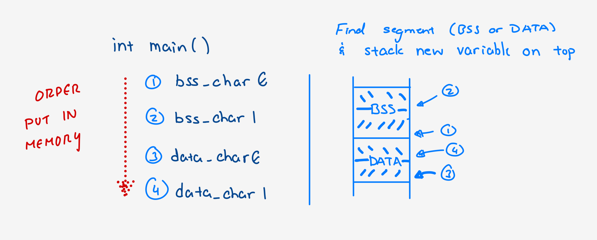
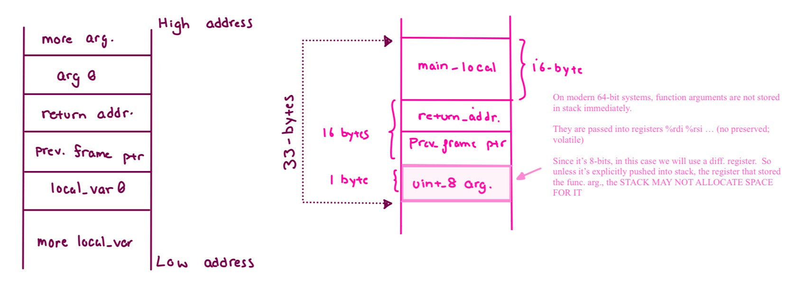

# Memory Layout

* Based on A6 from Steven Ko CMPT 201 REPO
* When you have a program as an executable, it is a file stored on your disk. However, when you run the program, your OS loads the program to the main memory and starts executing the program. 

    => This means that there exist two copies of the program when you run it---one copy on the disk and another copy in memory.

* `Memory Layout` - the format used to exec a program loaded into memory by OS

## Linux Memory Layout and C Pointers

Every single thing in your program, all the statements, all the variables, and all the function
calls, occupies memory space when you run the program. 

Your OS organizes the memory space in a certain way using its pre-defined memory layout and your program's code interacts with the memory
space to actually run the program.

Below is a simplified diagram of how Linux organizes the memory space when it runs a program.

```bash
.──────────────────────.
|                      | Address 2^n - 1        <-- highest addresss here
| Kernel address space | (n is the number of address bits)
|                      |
+──────────────────────+
|                      |
| Stack                |
| (grows ↓)            |
|                      |
+──────────────────────+
|                      |
|                      |
+──────────────────────+
|                      |
| Memory mapping       |
| (grows ↓)            |
|                      |
+──────────────────────+
|                      |
|                      |
+──────────────────────+
|                      |
| Heap                 |
| (grows ↑)            |
|                      |
+──────────────────────+
|                      |
+──────────────────────+
|                      |
| BSS                  |
| (Uninitialized       |
|  global              |
|  or static data)     |
|                      |
+──────────────────────+
|                      |
| Data                 |
| (Initialized         |
|  global              |
|  or static data)     |
|                      |
+──────────────────────+
|                      |
| Text (Code)          |
|                      |
+──────────────────────+
|                      |
|                      |
|                      | Address 0      <-- lowest address here
'──────────────────────'
```

Before examining the diagram in more detail, there are a few things to note.

* The memory layout:
    1) Is segmented (kernel address, stack, etc)
    2) Determines the memory space that a program can use. Notice that the size of the 
        diagram is `finite`. This means that the memory space your program can use is also finite.

* `fork()` a child process, this whole layout is cloned, i.e., the child becomes an exact
  copy of the parent.
* `Byte-addressable memory` - Each memory address identifies a single byte.
* The memory address space starts from 0.

### C - About Pointers
* Pointers store a memory address eg) `int *ptr = 0` => `ptr` now holds the memory
  address 0 as its value. There are a few things to note here.
    * `T *ptr` means `ptr` is a variable of `type T` 

        `eg) int *ptr => ptr is of type int*`

    * A pointer has a size limit according to the size of its type.
    
        eg) The values of `int32_t i` uses 32-bits 
                => the range for `i` is -2^31 (`INT32_MIN`) to 2^31-1 (`INT32_MAX`). 
        
        eg) `int* ptr`, its value can only range from the minimum value
    
    All pointer types (`int *`, `char *`, `void *`, etc.) are of the same size, 
    and they are typically either 32 bits or 64 bits, depending on what CPU you use. 
    If you use a 32-bit CPU, it is 32 bits. If you use a 64-bit CPU, it is 64 bits. 
        
    For example, if the pointer types are represented as 32 bits, their values can only be between 0 and 2^32-1.

    * This effectively means the size of a pointer type limits the size of the memory
      space that a program can use. 
      
      32-bit can only range values between 0 and 2^32-1, 

        => the range of memory addresses must be between 0 and 2^32-1. 
        
        => This effectively limits the size of the memory address space to 4GB. 
        
        Since each address is byte addressable and 2^32 is 4 * 2^30, a 32-bit pointer can identify 4GB (gigabytes) of memory. 
        
        In case of a 64-bit pointer (16 * 2^60), it is 16 exabytes.

* We can `use + OR - operations` to move the address a pointer points to in memory.
    => Thereby, changing the thing that the pointer is pointing to.

``` Examples:
int num = 0; 
int* INT_ptr = &num

INT_ptr + 1 // increases the address value in ptr by SIZE OF POINTER TYPE => int (4 bytes) 

char* CHAR_ptr = &some_char

INT_ptr + 1 // increases the address value in ptr by SIZE OF POINTER TYPE => size char (1 bytes) 

================================================================================================
RECALL: Dereference pointers to change value that the ptr is pointing to

*INT_ptr = *INT_ptr + 1 // num => 0 + 1 = 1

(*INT_ptr)++ will also work
```
#### Pointers && Arrays
    Using pointer arithmetic, you can use pointers and arrays
    interchangeably. 
    
    ``` Example: 
    int *address    // address[i] will works exactly the same as *(address + i). 
    
    They both allow you to access the memory location that is *i* integers higher from the memory location pointed to by `address`.

    => It is as if you declared an array:
        int address[]  instead of a pointer, int *address 
        
        since arrays and pointers are interchangeable.

## Understanding the Text Segment (Bottomost Layer) - [MEMORY LAYOUT DIAGRAM](src/memory_layout_diagram.md)

The OS loads the program itself to this segment => i.e., the text segment contains the (compiled) code
of the program. This means that your code resides somewhere in memory when you're running your
program. 

In fact, we can examine the memory and print out your (compiled) code at run time.


```c
#include <stdint.h>
#include <stdio.h>

int main(void) {
  int (*main_ptr)(void); // Define a function pointer pointing to main()=> f_returnTYPE (*f_ptr_NAME)(f_type)
  main_ptr = &main; // Assign the address of main() to the pointer. If you'd ike, you can omit `&`.
                    // f_ptr now points to main() first byte of code

  uint8_t *start_address =
      (uint8_t *)main_ptr; // Cast it to an unsigned byte pointer for reading - uint8* denotes it is a byte pointer

  printf("Dumping memory from address %p:\n", start_address);

  for (size_t i = 0; i < 64; i++) { // Starting at current address of pointer (start of main()), 
                                    // => read the next 64 bytes of code in main()
    printf("%02X ", start_address[i]); // Hex formatting

    if ((i + 1) % 16 == 0) // Just print 16 bytes per line
      printf("\n");
  }

  return 0;
}
```

In the first three lines of `main()`, we use C's [function pointer
feature](https://en.wikipedia.org/wiki/Function_pointer) to get the address of the first byte of
`main()`'s code, stored in the text segment in memory.
* Defining a variable as a function pointer, 
    => `int (*main_ptr)(void);`
        
        (i) `main_ptr` is a function pointer variable

        (ii) and it points to a function that returns an integer && takes no parameters

            => (`'int' in 'int main(void)) && (`(void)` at the end).

What's printed out is the first 64 bytes of `main()`'s compiled code loaded in
the text segment in memory.

### How do we know if this is correct code? 

* Use `objdump` to print contents of executable. 

#### Executables 

Executables (the file itself) are organized into sections with similar names as the memory layout, 

    e.g., the text section, the data section, etc.

`objdump` allows us to examine these sections. 

`COMMAND: `objdump -s <the name of the compiled executable>`

`OR BETTER USE COMMAND 'less': objdump -s <the name of the compiled executable> | less` will show the contents of executables, organized as sections.


Look for the text section and look for the matching bytes that you get from running your code. You
will find that all 64 bytes are present in the output of `objdump` in exactly the same order as our
program prints out.

## Understanding the Data and BSS Segments (Layer Above Text) - [MEMORY LAYOUT DIAGRAM](src/memory_layout_diagram.md)

* Data and BSS segments store the values for global or static variables in a program. 

    => Data Stores *initialized* variables
    
    => BSS segment stores *uninitialized* variables. 

``` Example:

static char *example_string = "This is initialized.\n";` // gets stored in the data segment. 

static char *example_string;` // gets stored in the BSS segment.
```

```c
#include <stdio.h>

char bss_char0;                                                 |   // Each variable will take up EXACTLY ONE byte              
char bss_char1;                                                 |   // b/c 'char' type has the size of one byte
char data_char0 = '0';                                          |   
char data_char1 = '1';                                          |  
                                                                |
                                                                |               OUTPUT
int main() {                                                    |
  printf("data_char0 address: %p\n", &data_char0);              |   data_char0 address: 0xaaaacdfe1038
  printf("data_char1 address: %p\n", &data_char1);              |   data_char1 address: 0xaaaacdfe1039
  printf("bss_char0 address:  %p\n", &bss_char0);               |   bss_char0 address:  0xaaaacdfe103b
  printf("bss_char1 address:  %p\n", &bss_char1);               |   bss_char1 address:  0xaaaacdfe103c

  return 0;
}
```
Based on output, you can draw a diagram that visualizes the output:

NOTE: In the Memory Layout Diagram, BSS segment is on top of Data segment; 
variables get stacked ontop of the last variable of that segment

 

```bash
+────────────+
| bss_char1  | 0xaaaacdfe103c   // same for bss_char1 with bss_char0; last variable in f'cn is here
+────────────+
| bss_char0  | 0xaaaacdfe103b   // NOTE that the address grow 'up'; 
+────────────+                  // => BSS segment starts here, so bss_char0 gets put here since its before bss_char1
|            | 0xaaaacdfe103a
+────────────+
| data_char1 | 0xaaaacdfe1039   // data_char1 will come after data_char0 b/c its defined later;
+────────────+
| data_char0 | 0xaaaacdfe1038   // => DATA segment starts here, so data_char0 gets put here since its before data
_char1
+────────────+
```

### Why do we need a separate BSS segment and not just the data segment? 

The BSS segment is automatically filled with zeros so we can still 
initialize uninitialized global and static variables. This helps ensure that 
these variables start with a known and predictable value.

## Task 2: Understanding the Stack Segment  - [MEMORY LAYOUT DIAGRAM](src/memory_layout_diagram.md)

The stack segment, sometimes referred to as *the call stack* or just *the stack*, is the memory
space where local variables and function arguments are stored. A typical program has multiple
functions, and the stack's size changes as different functions get called. Let's do a couple of
activities to learn about this more. Make sure you `record` if you are not doing it already.

### Stack Basics - Stacks Grow Downward

```c
#include <stdint.h>
#include <stdio.h>

void test0(void) { 
  int8_t local0 = 1;    // placed in stack first
  int8_t local_array[3] = {2, 3, 4}; // then the array; starting with 2 THEN 3 THEN 4
  int8_t local1 = 5; // place last in stack

  printf("test0:\n");
  printf("  local0 address:         %p\n", &local0);
  printf("  local_array[0] address: %p\n", local_array);
  printf("  local_array[1] address: %p\n", (local_array + 1));
  printf("  local_array[2] address: %p\n", (local_array + 2));
  printf("  local1 address:         %p\n", &local1);
}

int main(void) {
  test0();
}
```

Compile and run it. You should get an output similar to the following:

```bash
Notice the first item (local0) that got put in the stack has the highest address 
and the last (local1) has the lowest. 

=> This is b/c stack grows downwards 

test0:
  local0 address:         0xffffdf138fbf
  local_array[0] address: 0xffffdf138fbc
  local_array[1] address: 0xffffdf138fbd
  local_array[2] address: 0xffffdf138fbe
  local1 address:         0xffffdf138fbb
```

You can visualize this as follows:

```bash
+────────────────+
|     local0     | 0xffffdf138fbf
+────────────────+
| local_array[2] | 0xffffdf138fbe
+────────────────+
| local_array[1] | 0xffffdf138fbd
+────────────────+
| local_array[0] | 0xffffdf138fbc
+────────────────+
|     local1     | 0xffffdf138fbb
+────────────────+
```

```c
CONSIDER THIS EXAMPLE OPENING WITH THE SAME VARIABLES AND STORED VALUES AS ABOVE
void test1(void) {
  int8_t local0 = 1;
  int8_t local_array[3] = {2, 3, 4};
  int8_t local1 = 5;

  printf("test1:\n");
  printf("  local0 value: %d\n", local0);

  local_array[3] = 24;  // The array only has 3 elements; local_array[3] out of bounds
                        // BUT we can still use it b/c an array in C is just a pointer.
                        // => `local_array[3]` is simply `*(local_array + 3)`

  printf("  local0 value: %d\n", local0);
}
```
Excluding the output from `test0()`, your output should show the following:

```bash
test1:
  local0 value: 1
  local0 value: 24
```

In the code, `local0` is initialized to 1, and there is no other place where we directly change the
value of `local0`. However, the second `printf()` prints out 24, not 1. What happened? The reason is
that `local_array[3]` points to the memory address of `local0`. So when we assign 24 to
`local_array[3]`, we are writing to the memory space occupied by `local0`. Let's visualize this.

```bash
+───────────────────────────────+
| local0 (also, local_array[3]) | 0xffffdf138fbf    // local0 started as 1 THEN became 24 when we used 
+───────────────────────────────+                      local_array[3] to access it
| local_array[2]                | 0xffffdf138fbe    
+───────────────────────────────+
| local_array[1]                | 0xffffdf138fbd
+───────────────────────────────+
| local_array[0]                | 0xffffdf138fbc    // local_array starts here 
+───────────────────────────────+
| local1                        | 0xffffdf138fbb
+───────────────────────────────+
```

`Array out of bounds error` occurs where an array variable is used to access memory locations outside the array's bounds.

We can use any local variable to manipulate other local variables. Add the following
function and call it from `main()`.

```c
void test2(void) {
  int8_t local_array[3] = {2, 3, 4};
  int8_t local0 = 5;

  printf("test2:\n");
  printf("  local_array[1] value: %d\n", local_array[1]);       //prints 3

  int8_t *ptr = &local0 + 2; // This points to `local_array[1]` // pointing at the box that stores 3
  *ptr = 36;                 // 3 -> 36

  printf("  local_array[1] value: %d\n", local_array[1]);
}
```
We can visualize this again.

```bash
+──────────────────────────────────+
| local_array[2]                   | 0xffffdf138fbe     <-- stores 4
+──────────────────────────────────+
| local_array[1] (or *(&local0+2)) | 0xffffdf138fbd     <-- stores 3 ; later becomes 36
+──────────────────────────────────+
| local_array[0]                   | 0xffffdf138fbc     <-- stores 2
+──────────────────────────────────+
| local0                           | 0xffffdf138fbb     <-- stores 5
+──────────────────────────────────+
```
#### Important: Stack Corruption
The important point here is that it is possible to use a local variable's address to access other
local variables. This often causes problems, generally called *stack corruption*---you access stack
locations unintentionally and corrupts the stack. Thus, we need to be extremely careful when using
arrays and pointers.

### Stack with Function Calls

* The stack not only stores local variables but also stores arguments passed for function calls. There are potentially many function calls.

`Stack Frame` is created by the stack to store and organize local variables of functions.
    => New function call, the stack -> new stack frame and stores local variables, arguments, and other things necessary.

The stack with stack frames looks like the following.

```bash
+─────────────────────+ Higher address
| main() stack frame  |
+─────────────────────+
| foo() stack frame   |
+─────────────────────+
| (grows down)        |
+─────────────────────+ Lower address
```

Here, we are showing an example where, inside `main()`, there is a function call to `foo()`. For
each function call, a new stack frame gets created and pushed to the stack, and it grows downward.
Thus, if `foo()` makes a function call to `bar()`, the stack will look like the following.

```bash
+─────────────────────+ Higher address
| main() stack frame  |
+─────────────────────+
| foo() stack frame   |
+─────────────────────+
| bar() stack frame   |
+─────────────────────+
| (grows down)        |
+─────────────────────+ Lower address
```

If `bar()` is done and the execution returns to `foo()`, the stack frame for `bar()` will be
popped, and the stack will look like the following.

```bash
+─────────────────────+ Higher address
| main() stack frame  |
+─────────────────────+
| foo() stack frame   |
+─────────────────────+
| (grows down)        |
+─────────────────────+ Lower address
```

Now, a single stack frame *generally* looks like the diagram below, but it depends on many factors
such as your CPU, compiler, OS, configuration, etc. The diagram uses the basic Linux configuration
of the 32-bit x86 CPUs as an example.

```bash
+────────────────────────+ Higher address
| (more arguments)       |
+────────────────────────+
| argument0              |
+────────────────────────+
| Return address         |
+────────────────────────+
| Previous frame pointer |
+────────────────────────+
| local_variable0        |
+────────────────────────+
| (more local variables) |
+────────────────────────+ Lower address
```

Below are a few points about the diagram. We use *caller* and *callee* to distinguish the function
that makes a function call (caller) and the function that gets invoked (callee).

* Function arguments occupy the highest-addressed region of a stack frame. (This is traditionally
  called the *bottom* of the stack.)

* A stack frame saves the `return address`, which points to the caller's code that needs to be
  executed right after the function call returns. This is necessary to remember where to go back
  when the callee's code execution is done.

* A stack frame also saves the `previous frame pointer`, which points to the stack frame of the
  caller. This is necessary when popping the callee's stack frame after the callee's code execution
  is done.

The important point here is again the same point made earlier. Since these are all stored in the
same memory region, it is possible to use arrays/pointers of local variables to access other stack
frames, leading to potential stack corruption. `SEE BELOW understand this more.`

```c
#include <stdint.h>
#include <stdio.h>

void foo(uint8_t argument) {
  uint8_t foo_local = 16;
  printf("Local variable address in foo:  %p\n", &foo_local);
}

int main(void) {
  uint8_t main_local = 32; // uint_8 is 1 byte but stack allocates 16 bytes for it (see below)
  foo(main_local);
  printf("Local variable address in main: %p\n", &main_local);
}
```

Compile and run the program. You will get an output similar to the following:

```bash
Local variable address in foo:  0xffffd064d30e
Local variable address in main: 0xffffd064d32f
```
#### See pic below for visual of description 
*The address difference is 0x21 or 33 bytes. Understanding this requires an in-depth discussion about
how things work, which we won't get into here. 
*Our container uses a 64-bit CPU and a `stack allocation always takes up a multiple of 16 bytes` for faster execution. 

    => Thus, to store `uint8_t main_local` in `main()`, the stack allocates 16 bytes instead of one byte. 
    

* After the `return address and the previous frame pointer` shown in the diagram above `take up 8 bytes`
each. Lastly, `uint8_t argument` takes up another one byte. Thus, those four variables take up 33
bytes in the stack. The local variable `uint8_t foo_local` comes after those variables in the stack,
so the address difference between `uint8_t foo_local` and `uint8_t main_local` is 33 bytes.



Needless to say, misusing arrays or pointers with `uint8_t foo_local` in `foo()` can affect `uint8_t
argument`, the return address, the previous frame pointer, and `uint8_t main_local`. In fact, this
can cause a very serious problem known as: 

`stack buffer overflow attack`, where the return address is replaced with an address that points to a 
malicious piece of code by overflowing a buffer. 

The simplest example, though not an actual attack, is something like the following:
```c
#include <stdio.h>

int main(void) {
  char buffer[5] = {0};     // 5 bytes
  scanf("%s", buffer);      // The input string is too long (22 bytes) => segmentation error && buffer overflowed
}
```

Create a file named `buffer_overflow.c` and write the above code. You will immediately see that our
linter complains about `scanf()` being insecure, which is exactly what this example is about. 

Give `scanf()` the input `this-is-a-long-string` It is going to cause a segmentation fault.

##### Important 
Since this is a common, yet serious problem, there is a sanitizer that detects this problem. 

Use `-fsanitize=address` to enable AddressSanitizer flag.

Provide the same input `this-is-a-long-string`. It should immediately show a long error message that
explains the stack buffer overflow error.


```bash
+─────+
| ... |
+─────+
| '-' | buffer[7] (beyond the bound; overwriting the stack)
+─────+
| 's' | buffer[6] (beyond the bound; overwriting the stack)
+─────+
| 'i' | buffer[5] (beyond the bound; overwriting the stack)
+─────+
| '-' | buffer[4]
+─────+
| 's' | buffer[3]
+─────+
| 'i' | buffer[2]
+─────+
| 'h' | buffer[1]
+─────+
| 't' | buffer[0]
+─────+
```

Other standard library functions that read user inputs, e.g., `gets()`, or copy memory, e.g.,
`strcpy()`, have similar problems and their use is explicitly discouraged or warned. 

The man page of `gets()` (`man gets`), says `Never use this function`. 
The man page of `strcpy()` says `Beware  of  buffer overruns!`.

`Safer alternatives: fgets() or strncpy()` 

NOTE: You will need to specify the size for these funcitons (Of course, you need to provide the right size to be safe.)

It is also important to keep in mind that you don't have an unlimited stack. In fact, allocating too
much memory with your local variables will cause a *stack overflow* error. Compile and run the code 
below with `-fsanitize=address` to enable the `AddressSanitizer`.

```c
int main(void) { char a[1048 * 1048 * 8] = {0}; }   // stackoverflow; the stack ran out of memory for a[]
```

Error message shown by the `AddressSanitizer` explains detected stack overflow error. 
`Use getlimit()` to check the capacity you can allocate.  It does not take a lot to trigger a stack overflow
error but the limit varies across systems.

## Stack Protection

Since a developer can misuse the stack in many ways as described above, popular compilers such as
GCC and Clang provide stack protection mechanisms. [This
article](https://developers.redhat.com/articles/2022/06/02/use-compiler-flags-stack-protection-gcc-and-clang)
discusses the mechanisms in detail. It is a good read to understand the available features for stack
protection.